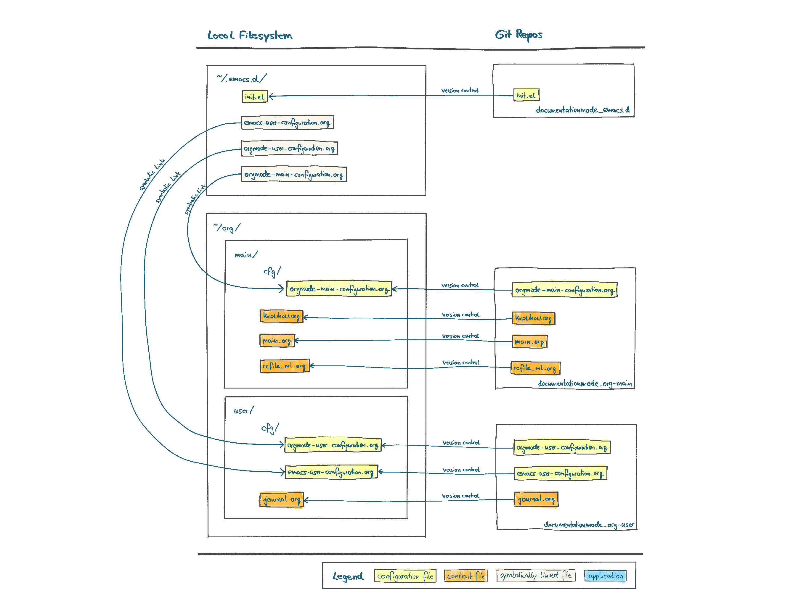
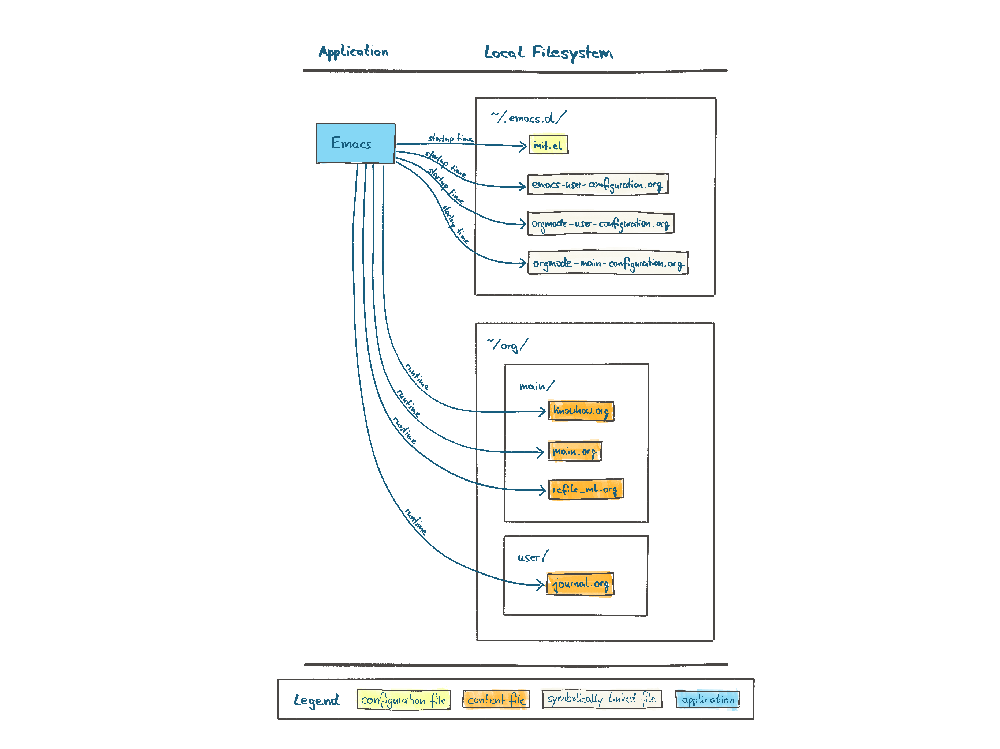

<!--
    Some meta information about this document:

    * I use the GitHub flavor of markdown.
    See [https://guides.github.com/features/mastering-markdown](https://guides.github.com/features/mastering-markdown) for how to use it.

    * I follow the one sentence per line approach which I came across several years ago when learning AsciiDoc(tor).
    See [https://asciidoctor.org/docs/asciidoc-recommended-practices/#one-sentence-per-line](https://asciidoctor.org/docs/asciidoc-recommended-practices/#one-sentence-per-line) for the reasoning behind this approach.

    * Most parts of this whole article I have written with Visual Studio Code, benefitting from its in-built Markdown support. To get the table of content created automically, I have added the extension "alanwalk.markdown-toc". So, in case you would like to change something in the structure of this article, please consider using this extension as well to keep the toc consistent with the content.    
 -->

[(back to main page)](README.md)

# The Documentation Mode - How to configure

<!-- TOC -->

- [Motivation or: why do we accept the bulkiness of Emacs and Git?](#motivation-or-why-do-we-accept-the-bulkiness-of-emacs-and-git)
- [How to set it all up](#how-to-set-it-all-up)
    - [How to setup yourself](#how-to-setup-yourself)
    - [How to setup your computer](#how-to-setup-your-computer)
        - [Install Git](#install-git)
        - [Configure Emacs and the included Org](#configure-emacs-and-the-included-org)
        - [Install and start Emacs](#install-and-start-emacs)

<!-- /TOC -->

If you have read the [How to use](how-to-use.md) part, you are now maybe under the impression that all this is not too easy and fun to apply.
Having a Trello board or a JIRA project in place might look more intriguing than fiddling around with fancy keyboard shortcuts in a text editor from the last millennium.
And yes, using graphical tools make more fun because they (normally) are more eye-candy and also easier to use.

## Motivation (or: why do we accept the bulkiness of Emacs and Git?)

To better understand why I have defined the rules and tools the way they are, let's have a look at the requirements I wanted/needed to meet.

The tooling must allow to

* start documenting an event like a meeting or a phone call quickly enough while the event is still ongoing,
* find information about an earlier event quickly while you are already taking part in a next event,
* get an overview of all the tasks which are currently ongoing and when they need to be completed,
* have several persons work independently from each other, but still be able to synchronize all changes as often as needed,
* work locally when there is no proper network connection for a limited period of time,
* run all the tooling on Windows, MacOS, and Linux,
* only use tools which are freely available.

If you can accept that these requirements are valid, then tools like Trello and JIRA have at least the "problem" that they always need a network connection.
And when working for - say - a bank, it can happen that you are on travel, need to document something, and have no such network connection at all.

_Note:
When I defined these requirements, I didn't know that soon the Covid19 pandemia would make remote work possible._

## How to set it all up

You have come a long way when you have reached this part of the document.
In this part I explain how to setup the tooling and also yourself to get everything up and running.

### How to setup yourself

Before you can start using the tools, you as a person maybe need to do some modifications to yourself :-)

* **You like to use keyboard shortcuts as the base mode of operation.**
This is the consequence of having a tooling in place which allows fast creation of documents:
You need to use the keyboard and a bunch of shortcuts instead of the mouse.
* **You are willing to learn a completely new set of keyboard shortcuts.**
Even if you already are a shortcut buff (like myself), you unfortunately need to learn a complete new set of shortcuts.
This can be confusing, especially if some of these shortcuts have a complete different meaning than what is used elsewhere.
Best examples:
    * The well-know "CTRL-c" will NOT copy selected text.
    Instead, this shortcut starts a sequence of subsequent shortcuts.
    * And the corresponding "CTRL-v" will NOT paste the current content of the clipboard to the cursor location.
    Instead, it will move the cursor one whole page down.

    As already said:
    Very confusing, I know.

### How to setup your computer

To get documentation mode rules up and running on your computer, you need to prepare the following things:

#### Install Git

As you will learn in a few moments, we use Git repos as the backbone of the communication between the team members.
Therefore you need to have a not too old version of Git installed – nothing special about this.
At the time of writing this text, I used Git version 2.33.0 on MacOS.

#### Configure Emacs and the included Org

You will be using Emacs and the included so-called "Org major mode" for most of the documentation.
Unfortunately, Emacs and especially Org mode are quite configuration-heavy.
Fortunately, Emacs is structured in such an open and extensible way that it is possible to have the needed configuration externalized in files and folders.
And externalizing the configuration is exactly what I have done.

Before I go into more details about this, have a look at the following diagram which shows all the participating folder, files, Git repositories, and how they are related:

All configuration is stored in three different Git repos.
Two repos are meant to be only used by yourself, whereas the third one is used to share information between all team members.

| Repo URL (github.com/martinleggewie/...) | Type | Location in local file system | Description |
| :-- | :-- | :-- | :-- |
| [.../documentationmode_emacs.d](https://github.com/martinleggewie/documentationmode_emacs.d)  | Only for you | `~/.emacs.d` | Contains the bootstrap Emacs configuration which mainly contains of only one very short `init.el` file.                    |
| [.../documentationmode_org-main](https://github.com/martinleggewie/documentationmode_org-main) | Shared       | `~/org/main` | Contains the Org Mode configuration and all the content relevant for all team members.                                   |
| [.../documentationmode_org-user](https://github.com/martinleggewie/documentationmode_org-user) | Only for you | `~/org/user` | Contains the Emacs configuration plus Org Mode configuration and content which you consider to be only relevant for you. |

As just mentioned in the table above, the `init.el` file is very short.
In fact, this file does nothing more than loading three other configuration files:

* `~/.emacs.d/emacs-user-configuration.org`
* `~/.emacs.d/orgmode-main-configuration.org`
* `~/.emacs.d/orgmode-user-configuration.org`

As the `~/.emacs.d` Git repo does not contain these files itself, you need to provide them by yourself.
But fear not, the files are very close by.

The main idea is that you store and keep these three configuration files in the ´./cfg´ subfolders inside the other two Git repos because then you can share the configuration with your other team members.
This is especially helpful for `orgmode-main-configuration.org` as it is this file where I have specified the Org Mode templates, tags, agenda and some more settings on which the team would need to agree on.

But at the moment Emacs cannot load these files because they are not yet at their intended location.
To solve this, we use the operating system's symbolic link feature to symlink each of these three files to the location where Emacs looks for them.
The `~/.emacs.d` Git repo stores small batch scripts which execute the needed symlink commands.

Let's have a closer look to the three different configuration files:

1.  `emacs-user-configuration.org` (stored in `~/org/user/cfg/emacs-user-configuration.org`)

    As its name maybe implies, this file contains personal Emacs configuration which makes Emacs usable in the context of Org Mode.
    Like with all the other configuration files the Git repos contain, I have stored the Emacs configuration in the "descriptive programming way".
    I have provided some explanation for each of the configuration settings so that I have a real chance to still understand all these settings after a month or so.
    And because the configuration file itself is also an Org Mode file, you can export the whole content (for example) as an HTML file, using Org Mode's export feature.
    In order to enable Emacs to directly load the configuration, I have specified in the `init.el` to use the so-called babel package.

2.  `orgmode-main-configuration.org` (stored in `~/org/main/cfg/orgmode-main-configuration.org`)

    This file contains that part of the Org mode configuration which is relevant for the whole team.
    Therefore you don't have that much freedom on how this configuration should look like and where you store it.

3.  `orgmode-user-configuration.org` (stored in `~/org/user/cfg/orgmode-user-configuration.org`)

    Not all parts of the Org mode configuration is suitable to be stored in the shared Git repo for the whole team.
    In order to get everything working, you most likely need to configure the following settings:

    * `user-full-name`: Contains your first and last name in one string, e.g. "Martin Leggewie".
    * `org-default-notes-file`: Contains the path to your refile file, e.g. "\~/org/main/refile_ml.org".
    * `org-default-journal-file`: Contains the path to your journal file, e.g. "\~/org/user/journal.org".

#### Install and start Emacs

There is not much to say about this requirement.

* For Windows:
  * Navigate to <https://www.gnu.org/software/emacs/download.html>, and then scroll down to the "Windows" section.
  * Then navigate to the "nearby GNU mirror", and from there navigate to the latest Emacs version folder.
    By the time of writing, this has been "emacs-26".
  * From the list of all various Emacs bundles, download the one with the latest version including the dependencies.
    By the time of writing, this has been "emacs-26.3-x8664.zip".
  * Unzip this to a location of your liking.
  * Start Emacs by executing "bin/emacs.exe".

* For MacOS:
  * Navigate to <https://emacsformacosx.com>.
  * Download the latest version as a DMG file.
  * Mount the DMG file and copy the Emacs application folder to a place of your liking.
  * Maybe you have already guessed it:
    Start Emacs by executing the Emacs application.

If you have configured Emacs as described in the previous step, Emacs will try to download some packages.
Please allow it to do so.
It might be necessary that you configure a proxy server so that Emacs is able to connect to the Internet.
Put something like the following in your `emacs-user-configuration.org` file:

`(setq url-proxy-services '(("no_proxy" . "^\\(localhost\\|10.*\\)") ("http" . "localhost:8079") ("https" . "localhost:8079")))`

But in the end you should see the blank editor window.
(From my experience there will most likely be problems because Emacs is a complicated beast of software.
Sorry.)

The following diagram shows which parts of the whole configuration of files and folders Emacs reads and writes during startup and runtime of Emacs.

For example, the Git repos are not at all relevant if you just want to use Emacs and Orgmode.
And you can also see that Emacs only checks the symbolically linked configuration files, not the configuration files themselves.

[(back to main page)](README.md)

----

_Martin Leggewie, 2021-10-17_
